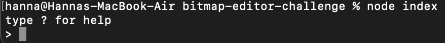
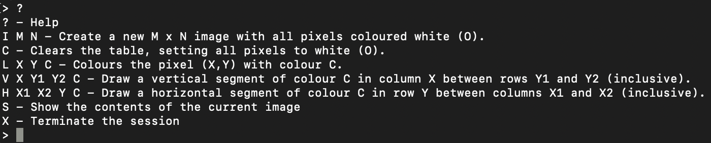
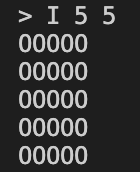
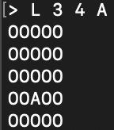

# Bitmap Editor Challenge
## Instructions
1. Fork this repo 
```
git clone git@github.com:hanna-98/bitmap-editor-challenge.git
```
2. Run ```npm install``` in your terminal to install the dependencies for this project

## Running tests
Use ```npx jasmine``` or ```npm test``` to run the tests

## Running the app
```
node index.js
```
## Usage
After running ```node index.js``` you should be presented with this prompt 



Please type '?' to see all the available commands for this app



### Example:
Say you wanted to colour the pixel in the third column and fourth row of a 5x5 image, you would first need to create a blank (white) 5x5 grid using the 'I' command like this



Then use the ```L``` command followed by ```3```, ```4``` and a colour of your choice



Be sure to leave a space between each of the characters you type

## Domain model
| Object | Properties | Messages | Context | Output | 
|------|----------|--------|-------|------|
| Image | | show() | Displays image | string |
| | colour pixel(s) @arr | clear() | Sets all pixels to white | string of Os|
| | | colour() | Colours one pixel | string of Os except one |
| | draw lines @arr | verticalLine() | Draws vertical line | string of Os except line |
| | | horizontalLine()| Draws horizontal line | string of Os except line |
| Bitmap editor | | run() | runs the app | string |
